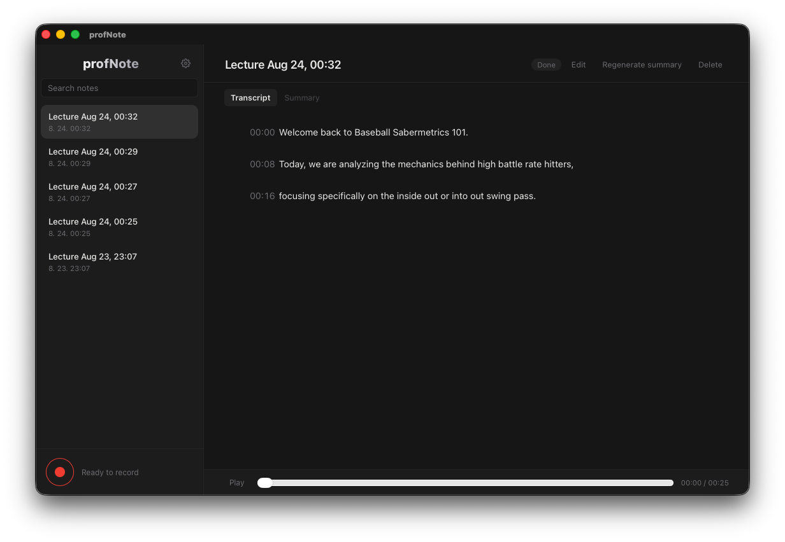

<div align="center">

# profNote

[](https://github.com/jeonjw85/profNote/actions/workflows/ci.yml)
[](https://github.com/jeonjw85/profNote/releases/latest)



</div>

[English](README.md)

강의 녹음을 화자 분리, 로컬 STT, LLM 요약으로 Markdown 노트로 정리하는 데스크탑 앱

## 설치

[Releases](https://github.com/jeonjw85/profNote/releases/latest)에서 빌드를 받습니다

| macOS                  | Windows     |
| ---------------------- | ----------- |
| `.dmg` (Apple Silicon) | NSIS `.exe` |

macOS는 Homebrew로도 설치할 수 있습니다.

```bash
brew install --cask jeonjw85/tap/profnote
```

macOS 빌드는 ad-hoc 서명입니다.  
Gatekeeper는 그대로 막습니다 :: 시스템 설정 → 개인정보 보호 및 보안 → 그래도 열기  
Windows는 미서명입니다. 처음 실행 시 SmartScreen이 경고할 수 있습니다.

앱을 열고 마이크 권한을 허용한 뒤, 하단에서 FFmpeg와 Whisper 모델을 받으면 녹음을 시작할 수 있습니다.

## 기능

- 마이크 녹음, 또는 기존 음성 파일 끌어다 넣기
- 화자 분리 후 교수님 발화만 전사 (자동 추천, 수동 변경)
- 로컬 음성 인식, LLM 요약, 원문/요약 편집, `.md` 저장
- 타임스탬프 클릭 재생, 노트 검색, 요약 재생성
- 한국어/영어 UI, 요약 언어 선택

## 설정

설정에서 요약, 전사 언어, 화자 분리를 켜고 끌 수 있습니다.  
LLM은 OpenAI 호환 API를 씁니다.

화자 분리를 사용하고 싶을 시 :  
설정에서 엔진을 설치하고 [pyannote/speaker-diarization-3.1](https://huggingface.co/pyannote/speaker-diarization-3.1) 사용 조건에 동의한 뒤 HuggingFace 토큰을 넣으면 됩니다.  
엔진이 없으면 전사는 그대로 진행합니다

녹음, 모델, 노트는 `~/Library/Application Support/kr.jjw.profNote/`에 저장되고 전사는 로컬에서만 진행, 요약 시에만 전사 텍스트가 LLM API로 전송됩니다.

## 개발

Tauri v2, React 19, whisper-rs, pyannote, SQLite.

- macOS, Rust stable, Xcode Command Line Tools, Node.js 20+

```bash
npm install
npm run tauri dev
npm run tauri build
```

빌드 결과: `src-tauri/target/release/bundle/`

```bash
npm run typecheck
npm run lint
cargo test --manifest-path src-tauri/Cargo.toml
cargo clippy --manifest-path src-tauri/Cargo.toml
```

## 라이선스

[MIT](LICENSE)
